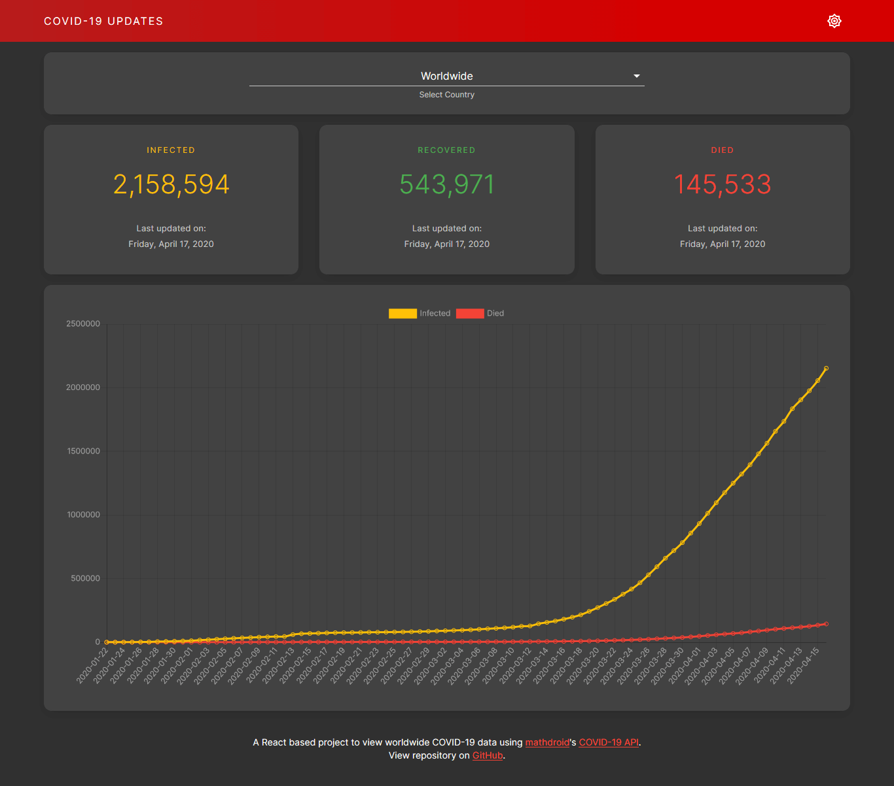

# React COVID-19 Tracker
A React application for viewing worldwide COVID-19 data.

See the working example at https://iftee.github.io/react-covid19-tracker/.

## Features
- Global historical data (total infected, total recovered and total died) in line chrat format.
- Countrywise updated data (total infected, total recovered and total died) in bar chart format. Countrywise historical data is not available.
- Dark (default) and light mode support.

## Developer Instruction
- Install all Node dependencies.
- Start the development server.

## Tools Used
- [Create React App](https://create-react-app.dev) to bootstrap the application
- [Mathdroid](https://mathdro.id)'s [COVID-19 API](https://covid19.mathdro.id/api) to fetch data from
- [Chart.js](https://www.chartjs.org) through [React Chart.js 2](https://github.com/jerairrest/react-chartjs-2) wrapper for charts
- Material Design through [Material-UI](https://material-ui.com) to make styled layout
